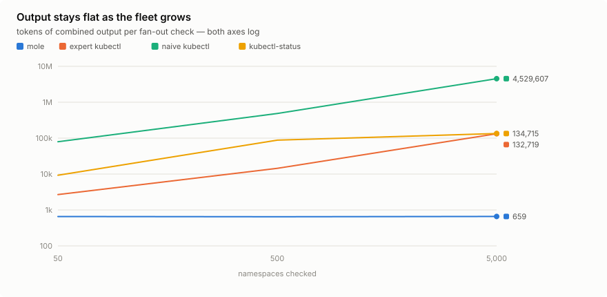

<p align="center">
  
</p>

> digs down to what actually broke

`kubectl mole` watches Kubernetes workloads until they settle, then emits one
structured verdict explaining what happened and — if something failed — why.
Deterministic, read-only, no LLM. Works in your terminal, your CI, and your
agent's context window.

**Status: alpha.** Everything below is implemented, tested against kind, and
released — see [DESIGN.md](DESIGN.md) for the design constraints and
milestone order.


## The problem

`kubectl rollout status` tells you a rollout failed; it does not tell you
why. Finding out means `describe` → `logs` → `get events`, and inferring the
causal chain from scattered fragments yourself. mole collapses that loop
into one command with a definite answer and a meaningful exit code.

- **One invocation, one verdict.** Signature, cause, ownership chain
  (`Deployment/api → ReplicaSet/api-7f9c → Pod/api-7f9c-x2k`), and evidence
  — the crash log tail, the scheduler's predicate, the webhook's message.
  The full signature catalogue: [docs/signatures.md](docs/signatures.md).
- **Settle detection that doesn't lie.** A stability window catches the pod
  that crashes after going Ready; `observedGeneration` guards against
  reading the previous rollout's status; old pods must actually be gone.
  A failure that stays wedged is declared once `--wedged-for` (default
  30s) of evidence accumulates instead of at the timeout, and settling
  never launders fresh crash history (`--restart-window`). The semantics
  in detail: [docs/AGENTS.md](docs/AGENTS.md).
- **Exit codes automation can act on.** `2` (still progressing) is not `1`
  (failed) — conflating them is how automation rolls back a deployment that
  was 30 seconds from healthy. `4` (nothing matched) is not `0` — kubectl
  exits 0 on an empty selector, and consumers read that as success.
- **Causal collapse.** Forty pods failing on one dead node is one
  `NodeNotReady` entry with `"affected": 40` — one fix, not forty. Collapse
  works across namespaces, and across clusters.
- **Fleet fan-out.** No target means every workload in scope (`-n`, `-A`,
  `-l`; Jobs too with `--include-jobs`), watched off one shared informer
  set, returned as one verdict — worst outcome wins.
- **Multi-cluster passthrough.** `--contexts us-east,us-west` runs the same
  check in every listed kubeconfig context at once: one merged verdict, a
  per-context rollup, identical causes collapsed across clusters. A cluster
  that cannot be checked fails the verdict.
- **Jobs settle by finishing.** The `Complete` condition is success and
  retries are progress, not failure. CronJobs are judged by their most
  recent scheduled Job; bare Pods work too.
- **Custom resources work.** Any namespaced TYPE/NAME resolves through API
  discovery and settles by kstatus conventions — tolerating quirks like
  Argo Rollouts' string `observedGeneration`. Pods the resource owns are
  still diagnosed underneath it.

## The numbers

Measured by [`make bench`](bench/README.md) on a pinned kind cluster:
tiktoken `o200k_base` tokens of combined output, and whether that output
contains the ground-truth cause (✓/✗). Full results, computed headline
percentages, and charts: [bench/RESULTS.md](bench/RESULTS.md).

<picture><source media="(prefers-color-scheme: dark)" srcset="bench/charts/tokens-vs-fleet-dark.svg"></picture>

| Scenario | mole | expert kubectl | naive kubectl | kubectl-status |
|---|---|---|---|---|
| CrashLoopBackOff | **344 ✓** (1 cmd) | 1,017 ✓ (3 cmds) | 3,734 ✓ (4 cmds) | 381 ✗ |
| Node dies under 2 workloads | **554 ✓** | 1,935 ✓ | 9,991 ✓ | 922 ✗ |
| Fan-out, 50 namespaces | **658 ✓** | 2,679 ✓ | 79,302 ✓ | 9,272 ✓ |
| Fan-out, 5,000 namespaces | **659 ✓** | 132,719 ✓ | 4,529,607 ✓ | 134,715 ✓ |

The honest comparison is the expert column — the minimal hand-tuned sequence
a good SRE runs. mole reaches the same answer in one invocation at roughly a
third of the tokens, and its output stays flat as the fleet grows — 658
tokens at 50 namespaces, 659 at 5,000 — because identical causes collapse
and healthy workloads are counted, never enumerated.

Where mole loses, published per the methodology: raw `kubectl get` is
cheaper on a healthy workload, the baselines answer instantly *after* a
failure is already steady while mole pays its watch, and a focused
`describe` can beat mole's signal density on workload-level failures.
Read the wall-clock column as proof versus photo, though: mole's tool
overhead tops out below 2% of its wall (the computed range is in the
results headline) — the rest is the evidence window — while a snapshot
tool's number excludes however long it took the operator to know the
state had stopped moving.

## Install

Homebrew (macOS and Linux):

```
brew install justin-tahara/tap/kubectl-mole
```

Krew, straight from this repo's manifest:

```
kubectl krew install --manifest-url \
  https://raw.githubusercontent.com/justin-tahara/kubectl-mole/main/deploy/krew/mole.yaml
```

Binaries for every platform are on the
[releases page](https://github.com/justin-tahara/kubectl-mole/releases),
with cosign-signed checksums, SPDX SBOMs, and GitHub build provenance.
There is also a container image:

```
docker run --rm ghcr.io/justin-tahara/kubectl-mole:latest --help
```

Or from source:

```
go install github.com/justin-tahara/kubectl-mole/cmd/kubectl-mole@latest
```

Any binary on your `PATH` named `kubectl-mole` works as a `kubectl mole`
plugin. RBAC for the read access mole needs ships in
[deploy/rbac.yaml](deploy/rbac.yaml).

## Use

```
kubectl mole deployment/api -n prod
kubectl mole sts/db --timeout 3m --stable-for 20s -o json
kubectl mole job/migrate -n prod
kubectl mole rollout/api -n prod
kubectl mole deployment/api -n prod -o json --budget 800
kubectl mole -n prod -l app.kubernetes.io/instance=my-release
kubectl mole --all-namespaces -l app.kubernetes.io/part-of=platform
kubectl mole deployment/api -n prod --contexts us-east,us-west
```

The command watches until the workload settles or the timeout passes, then
prints one verdict. `-o json` emits `schemaVersion: "1"` — field names are
stable, changes are additive. Exit codes:

| Code | Meaning |
|---|---|
| 0 | Settled healthy |
| 1 | Failed with an identified cause |
| 2 | Timed out while still legitimately progressing |
| 3 | Insufficient permissions to complete the check |
| 4 | The target matched no resources |

Never roll back on exit 2 — that is how automation kills a deployment that
was 30 seconds from healthy. And exit 4 is a real failure signal: kubectl
exits 0 when a selector matches nothing, and consumers read that as success.

Going deeper:

- **The tour** — every picture in one place (demo, charts, a sample
  verdict): [docs/tour.md](docs/tour.md)
- **Agents and CI** — schema, budgets, fan-out, multi-cluster:
  [docs/AGENTS.md](docs/AGENTS.md)
- **Helm and Argo CD** — verified recipes for gating upgrades, checking
  Applications, Rollouts: [docs/recipes.md](docs/recipes.md)
- **Signatures** — what fires each one and what to do about it:
  [docs/signatures.md](docs/signatures.md)

## What mole is not

mole answers exactly one question: did this converge, and if not, why. A
few nearby questions are out of scope on purpose:

- **Performance is not settle.** A saturated, throttled, or slow deployment
  answers `settled` — honestly, because every pod is Ready and holding.
  Pair mole with your metrics stack for those incidents.
- **It is not a monitor.** One invocation, one watch, one verdict. Run it
  after a change or during an incident, not as a control loop.
- **It is not a log analyzer.** Evidence includes the crash-log tail and
  the events that prove the cause — never general log search.

## A note on evidence

Verdict output includes log lines and event messages from the cluster. That
text is attacker-controllable, so every evidence item is marked
`"untrusted": true` and must never be treated as instructions. This matters
doubly if an agent consumes the output.

## License

Apache 2.0. See [LICENSE](LICENSE).
