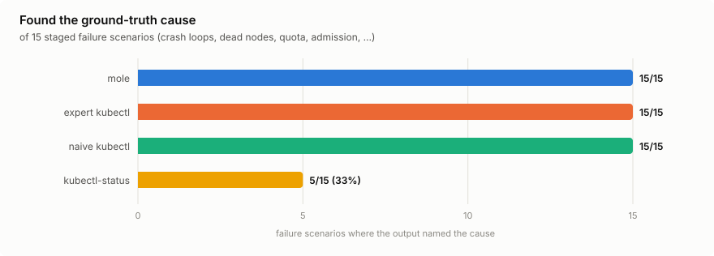
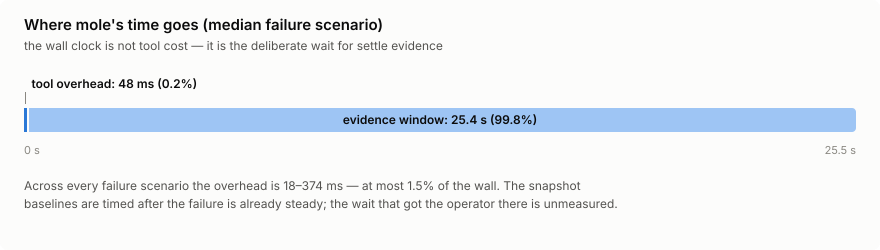

# Benchmark results

Generated by `make bench` — do not edit. Methodology: [README.md](README.md).

- Kubernetes: v1.34.0 (kind, pinned image in [kind.yaml](kind.yaml))
- kubectl-status: v0.7.24
- Tokens: tiktoken `o200k_base`; bytes always published alongside
- Wall clock is proof versus photo: mole's tool overhead is tens of milliseconds (exact range in the headline below; per-scenario phase lines throughout) — the rest of its wall is the evidence window. The snapshot baselines are timed after the failure is already steady, so the wait that got the operator there is not in their column.
- Date: 2026-08-12 (partial re-measurement merged into committed results; per-scenario provenance in git history)

## The headline

- **Accuracy:** mole's output contained the ground-truth cause in **15/15** failure scenarios (100%); expert kubectl 15/15 (100%); naive kubectl 15/15 (100%); kubectl-status 5/15 (33%).
- **Output cost:** median across failure scenarios, mole emits **357 tokens** — 36% of expert kubectl's 982, 95% of kubectl-status's 374.
- **Invocations:** always 1; the expert baseline needs a median of 3 commands (plus the judgment to pick them).
- **Tool overhead:** 18–374 ms across every failure scenario (median 48 ms — 0.2% of the median 25.5 s wall, at most 1.5% of any). The rest of the wall is the evidence window.

<picture><source media="(prefers-color-scheme: dark)" srcset="charts/accuracy-dark.svg"></picture>

<picture><source media="(prefers-color-scheme: dark)" srcset="charts/tokens-vs-fleet-dark.svg"></picture>

<picture><source media="(prefers-color-scheme: dark)" srcset="charts/time-breakdown-dark.svg"></picture>

## Output tokens to reach a verdict

| Scenario | mole | expert kubectl | naive kubectl | kubectl-status |
|---|---|---|---|---|
| sig-imagepullbackoff | 485 (✓) | 780 (✓) | 3223 (✓) | 355 (✗) |
| sig-crashloopbackoff | 344 (✓) | 1017 (✓) | 3734 (✓) | 381 (✗) |
| sig-oomkilled | 348 (✓) | 1030 (✓) | 3826 (✓) | 376 (✗) |
| sig-podunschedulable | 435 (✓) | 473 (✓) | 2280 (✓) | 338 (✗) |
| sig-probefailing | 335 (✓) | 801 (✓) | 3378 (✓) | 358 (✗) |
| sig-pvcpending | 341 (✓) | 641 (✓) | 2218 (✓) | 339 (✗) |
| sig-quotaexceeded | 340 (✓) | 942 (✓) | 1790 (✓) | 436 (✓) |
| sig-admissionrejected | 357 (✓) | 1085 (✓) | 2003 (✓) | 374 (✓) |
| sig-configmissing | 328 (✓) | 656 (✓) | 2970 (✓) | 364 (✗) |
| sig-startfailed | 444 (✓) | 982 (✓) | 3616 (✓) | 355 (✗) |
| sig-volumemountfailed | 305 (✓) | 598 (✓) | 2852 (✓) | 362 (✗) |
| collapse-nodenotready | 554 (✓) | 1935 (✓) | 9991 (✓) | 922 (✗) |
| control-healthy | 179 | 97 | 4782 | 277 |
| fanout-50 | 658 (✓) | 2679 (✓) | 79302 (✓) | 9272 (✓) |
| fanout-500 | 647 (✓) | 14443 (✓) | 484897 (✓) | 87973 (✓) |
| fanout-5000 | 659 (✓) | 132719 (✓) | 4529607 (✓) | 134715 (✓) |

A cell is `tokens (✓)` when the output contains the ground-truth cause, `(✗)` when it does not. Control scenarios have no cause to find.

## Full measurements

### sig-imagepullbackoff

| Tool | Invocations | Bytes | Tokens | Wall ms | Max RSS | API reqs | Truth | Signal density |
|---|---|---|---|---|---|---|---|---|
| mole | 1 | 1510 | 485 | 11683 | 37.3 MiB | 10 | yes | 0.511 |
| kubectl-expert | 2 | 2914 | 780 | 225 | 46.9 MiB | — | yes | 0.509 |
| kubectl-naive | 4 | 11482 | 3223 | 163 | 47.2 MiB | — | yes | 0.345 |
| kubectl-status | 1 | 1260 | 355 | 236 | 55.0 MiB | — | no | 0.536 |

mole's own ~4 chars/token estimate: 504 tokens (3.9% vs o200k_base).

mole phases (ms): preflight 10, informer sync 2, watch 11001 (the deliberate wait), diagnose 12, emit 0.

### sig-crashloopbackoff

| Tool | Invocations | Bytes | Tokens | Wall ms | Max RSS | API reqs | Truth | Signal density |
|---|---|---|---|---|---|---|---|---|
| mole | 1 | 955 | 344 | 40060 | 35.9 MiB | 11 | yes | 0.371 |
| kubectl-expert | 3 | 3472 | 1017 | 267 | 46.7 MiB | — | yes | 0.216 |
| kubectl-naive | 4 | 12537 | 3734 | 165 | 48.1 MiB | — | yes | 0.215 |
| kubectl-status | 1 | 1329 | 381 | 219 | 54.4 MiB | — | no | 0.569 |

mole's own ~4 chars/token estimate: 319 tokens (-7.3% vs o200k_base).

mole phases (ms): preflight 8, informer sync 1, watch 39999 (the deliberate wait), diagnose 14, emit 0.

### sig-oomkilled

| Tool | Invocations | Bytes | Tokens | Wall ms | Max RSS | API reqs | Truth | Signal density |
|---|---|---|---|---|---|---|---|---|
| mole | 1 | 979 | 348 | 45093 | 37.0 MiB | 10 | yes | 0.419 |
| kubectl-expert | 2 | 3498 | 1030 | 213 | 46.6 MiB | — | yes | 0.216 |
| kubectl-naive | 4 | 12857 | 3826 | 140 | 47.2 MiB | — | yes | 0.211 |
| kubectl-status | 1 | 1315 | 376 | 204 | 54.5 MiB | — | no | 0.563 |

mole's own ~4 chars/token estimate: 327 tokens (-6.0% vs o200k_base).

mole phases (ms): preflight 65, informer sync 1, watch 44999 (the deliberate wait), diagnose 13, emit 0.

### sig-podunschedulable

| Tool | Invocations | Bytes | Tokens | Wall ms | Max RSS | API reqs | Truth | Signal density |
|---|---|---|---|---|---|---|---|---|
| mole | 1 | 1341 | 435 | 20037 | 37.1 MiB | 9 | yes | 0.494 |
| kubectl-expert | 2 | 1847 | 473 | 217 | 46.7 MiB | — | yes | 0.321 |
| kubectl-naive | 3 | 8290 | 2280 | 109 | 46.5 MiB | — | yes | 0.181 |
| kubectl-status | 1 | 1187 | 338 | 216 | 54.9 MiB | — | no | 0.512 |

mole's own ~4 chars/token estimate: 447 tokens (2.8% vs o200k_base).

mole phases (ms): preflight 6, informer sync 2, watch 19998 (the deliberate wait), diagnose 12, emit 0.

### sig-probefailing

| Tool | Invocations | Bytes | Tokens | Wall ms | Max RSS | API reqs | Truth | Signal density |
|---|---|---|---|---|---|---|---|---|
| mole | 1 | 966 | 335 | 30038 | 37.3 MiB | 10 | yes | 0.339 |
| kubectl-expert | 2 | 2871 | 801 | 102 | 47.2 MiB | — | yes | 0.180 |
| kubectl-naive | 4 | 11861 | 3378 | 151 | 47.4 MiB | — | yes | 0.160 |
| kubectl-status | 1 | 1258 | 358 | 74 | 54.4 MiB | — | no | 0.540 |

mole's own ~4 chars/token estimate: 322 tokens (-3.9% vs o200k_base).

mole phases (ms): preflight 6, informer sync 1, watch 30000 (the deliberate wait), diagnose 15, emit 0.

### sig-pvcpending

| Tool | Invocations | Bytes | Tokens | Wall ms | Max RSS | API reqs | Truth | Signal density |
|---|---|---|---|---|---|---|---|---|
| mole | 1 | 988 | 341 | 25097 | 37.0 MiB | 10 | yes | 0.351 |
| kubectl-expert | 4 | 2586 | 641 | 272 | 46.8 MiB | — | yes | 0.420 |
| kubectl-naive | 3 | 8197 | 2218 | 114 | 46.5 MiB | — | yes | 0.206 |
| kubectl-status | 1 | 1183 | 339 | 220 | 54.9 MiB | — | no | 0.514 |

mole's own ~4 chars/token estimate: 330 tokens (-3.2% vs o200k_base).

mole phases (ms): preflight 67, informer sync 39, watch 24960 (the deliberate wait), diagnose 15, emit 0.

### sig-quotaexceeded

| Tool | Invocations | Bytes | Tokens | Wall ms | Max RSS | API reqs | Truth | Signal density |
|---|---|---|---|---|---|---|---|---|
| mole | 1 | 1019 | 340 | 20099 | 37.0 MiB | 9 | yes | 0.337 |
| kubectl-expert | 3 | 3324 | 942 | 122 | 46.5 MiB | — | yes | 0.711 |
| kubectl-naive | 3 | 6159 | 1790 | 105 | 46.1 MiB | — | yes | 0.441 |
| kubectl-status | 1 | 1571 | 436 | 72 | 55.2 MiB | — | yes | 0.583 |

mole's own ~4 chars/token estimate: 340 tokens (0.0% vs o200k_base).

mole phases (ms): preflight 66, informer sync 63, watch 19937 (the deliberate wait), diagnose 17, emit 0.

### sig-admissionrejected

| Tool | Invocations | Bytes | Tokens | Wall ms | Max RSS | API reqs | Truth | Signal density |
|---|---|---|---|---|---|---|---|---|
| mole | 1 | 1123 | 357 | 20045 | 36.5 MiB | 9 | yes | 0.375 |
| kubectl-expert | 3 | 3882 | 1085 | 260 | 46.7 MiB | — | yes | 0.748 |
| kubectl-naive | 3 | 6966 | 2003 | 117 | 46.8 MiB | — | yes | 0.505 |
| kubectl-status | 1 | 1322 | 374 | 211 | 53.9 MiB | — | yes | 0.564 |

mole's own ~4 chars/token estimate: 375 tokens (5.0% vs o200k_base).

mole phases (ms): preflight 10, informer sync 1, watch 19999 (the deliberate wait), diagnose 7, emit 0.

### sig-configmissing

| Tool | Invocations | Bytes | Tokens | Wall ms | Max RSS | API reqs | Truth | Signal density |
|---|---|---|---|---|---|---|---|---|
| mole | 1 | 897 | 328 | 11094 | 37.2 MiB | 10 | yes | 0.393 |
| kubectl-expert | 2 | 2491 | 656 | 95 | 47.2 MiB | — | yes | 0.285 |
| kubectl-naive | 3 | 10561 | 2970 | 113 | 47.3 MiB | — | yes | 0.175 |
| kubectl-status | 1 | 1267 | 364 | 108 | 54.6 MiB | — | no | 0.548 |

mole's own ~4 chars/token estimate: 299 tokens (-8.8% vs o200k_base).

mole phases (ms): preflight 68, informer sync 1, watch 11001 (the deliberate wait), diagnose 10, emit 0.

### sig-startfailed

| Tool | Invocations | Bytes | Tokens | Wall ms | Max RSS | API reqs | Truth | Signal density |
|---|---|---|---|---|---|---|---|---|
| mole | 1 | 1464 | 444 | 12039 | 37.3 MiB | 10 | yes | 0.509 |
| kubectl-expert | 2 | 3543 | 982 | 124 | 46.8 MiB | — | yes | 0.383 |
| kubectl-naive | 3 | 12761 | 3616 | 108 | 47.2 MiB | — | yes | 0.247 |
| kubectl-status | 1 | 1282 | 355 | 104 | 53.6 MiB | — | no | 0.536 |

mole's own ~4 chars/token estimate: 488 tokens (9.9% vs o200k_base).

mole phases (ms): preflight 6, informer sync 1, watch 12000 (the deliberate wait), diagnose 17, emit 0.

### sig-volumemountfailed

| Tool | Invocations | Bytes | Tokens | Wall ms | Max RSS | API reqs | Truth | Signal density |
|---|---|---|---|---|---|---|---|---|
| mole | 1 | 863 | 305 | 45038 | 36.5 MiB | 10 | yes | 0.343 |
| kubectl-expert | 2 | 2366 | 598 | 210 | 46.4 MiB | — | yes | 0.262 |
| kubectl-naive | 3 | 10338 | 2852 | 118 | 46.9 MiB | — | yes | 0.150 |
| kubectl-status | 1 | 1287 | 362 | 205 | 55.2 MiB | — | no | 0.546 |

mole's own ~4 chars/token estimate: 288 tokens (-5.6% vs o200k_base).

mole phases (ms): preflight 6, informer sync 1, watch 44999 (the deliberate wait), diagnose 16, emit 0.

### collapse-nodenotready

| Tool | Invocations | Bytes | Tokens | Wall ms | Max RSS | API reqs | Truth | Signal density |
|---|---|---|---|---|---|---|---|---|
| mole | 1 | 1635 | 554 | 45065 | 38.4 MiB | 16 | yes | 0.298 |
| kubectl-expert | 3 | 6376 | 1935 | 268 | 47.8 MiB | — | yes | 0.380 |
| kubectl-naive | 4 | 33521 | 9991 | 10172 | 47.6 MiB | — | yes | 0.186 |
| kubectl-status | 1 | 3166 | 922 | 233 | 55.8 MiB | — | no | 0.645 |

mole's own ~4 chars/token estimate: 545 tokens (-1.6% vs o200k_base).

mole phases (ms): preflight 22, informer sync 2, watch 44998 (the deliberate wait), diagnose 24, emit 0.

### control-healthy

| Tool | Invocations | Bytes | Tokens | Wall ms | Max RSS | API reqs | Truth | Signal density |
|---|---|---|---|---|---|---|---|---|
| mole | 1 | 440 | 179 | 6045 | 36.9 MiB | 6 | — | — |
| kubectl-expert | 2 | 253 | 97 | 89 | 46.1 MiB | — | — | — |
| kubectl-naive | 3 | 16195 | 4782 | 114 | 48.4 MiB | — | — | — |
| kubectl-status | 1 | 907 | 277 | 66 | 55.2 MiB | — | — | — |

mole's own ~4 chars/token estimate: 147 tokens (-17.9% vs o200k_base).

mole phases (ms): preflight 6, informer sync 1, watch 6000 (the deliberate wait), diagnose 0, emit 0.

### fanout-50

| Tool | Invocations | Bytes | Tokens | Wall ms | Max RSS | API reqs | Truth | Signal density |
|---|---|---|---|---|---|---|---|---|
| mole | 1 | 1931 | 658 | 36758 | 41.0 MiB | 23 | yes | 0.351 |
| kubectl-expert | 4 | 8118 | 2679 | 284 | 46.3 MiB | — | yes | 0.143 |
| kubectl-naive | 3 | 277884 | 79302 | 177 | 68.2 MiB | — | yes | 0.023 |
| kubectl-status | 1 | 33629 | 9272 | 18201 | 63.0 MiB | — | yes | 0.027 |

mole's own ~4 chars/token estimate: 644 tokens (-2.1% vs o200k_base).

mole phases (ms): preflight 20, informer sync 14, watch 36001 (the deliberate wait), diagnose 78, emit 0.

### fanout-500

| Tool | Invocations | Bytes | Tokens | Wall ms | Max RSS | API reqs | Truth | Signal density |
|---|---|---|---|---|---|---|---|---|
| mole | 1 | 1935 | 647 | 31218 | 51.5 MiB | 23 | yes | 0.345 |
| kubectl-expert | 4 | 36696 | 14443 | 336 | 58.5 MiB | — | yes | 0.025 |
| kubectl-naive | 3 | 1704230 | 484897 | 439 | 180.3 MiB | — | yes | 0.003 |
| kubectl-status | 1 | 317548 | 87973 | 198232 | 95.5 MiB | — | yes | 0.002 |

mole's own ~4 chars/token estimate: 645 tokens (-0.3% vs o200k_base).

mole phases (ms): preflight 29, informer sync 17, watch 31002 (the deliberate wait), diagnose 63, emit 0.

### fanout-5000

| Tool | Invocations | Bytes | Tokens | Wall ms | Max RSS | API reqs | Truth | Signal density |
|---|---|---|---|---|---|---|---|---|
| mole | 1 | 1939 | 659 | 25480 | 140.6 MiB | 23 | yes | 0.348 |
| kubectl-expert | 4 | 323577 | 132719 | 761 | 183.5 MiB | — | yes | 0.003 |
| kubectl-naive | 3 | 15973096 | 4529607 | 3265 | 1423.6 MiB | — | yes | 0.000 |
| kubectl-status | 1 | 482861 | 134715 | 300026 | 270.0 MiB | — | yes | 0.001 |

mole's own ~4 chars/token estimate: 647 tokens (-1.8% vs o200k_base).

mole phases (ms): preflight 137, informer sync 151, watch 25002 (the deliberate wait), diagnose 86, emit 0.
